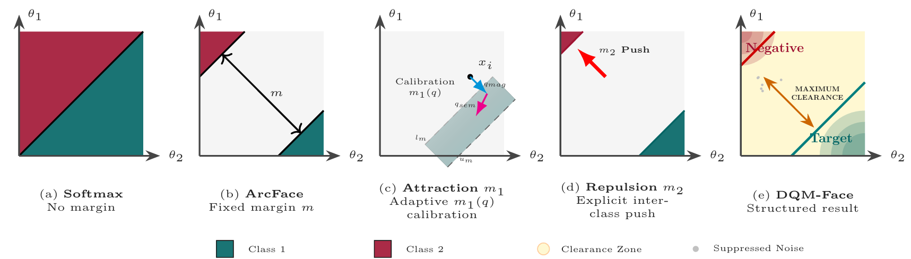
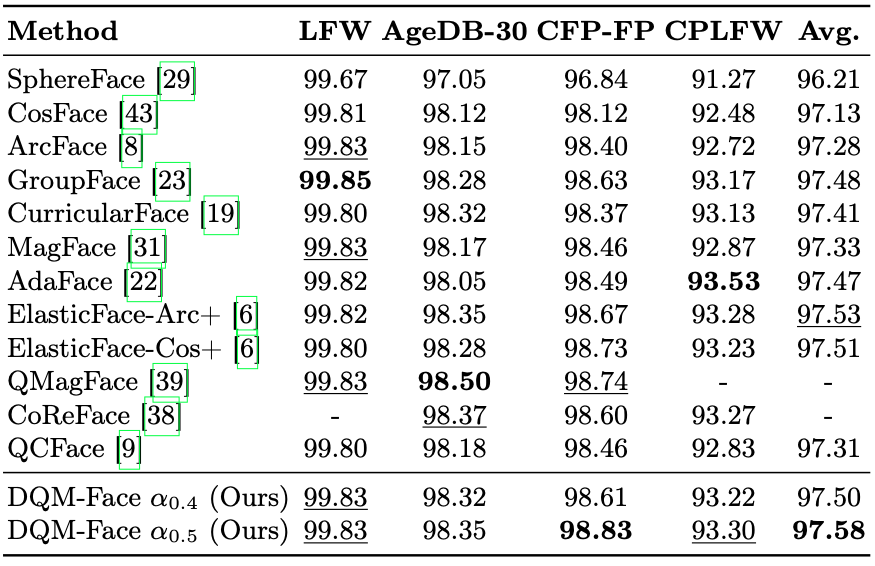
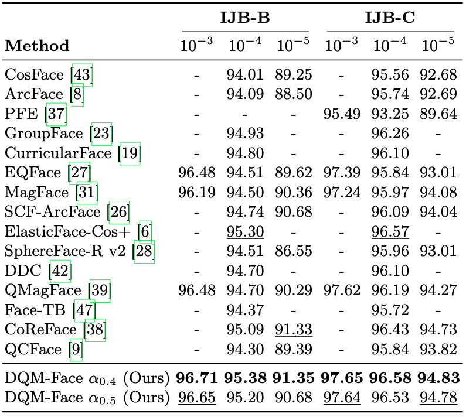
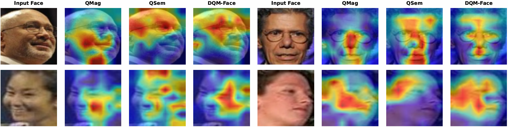
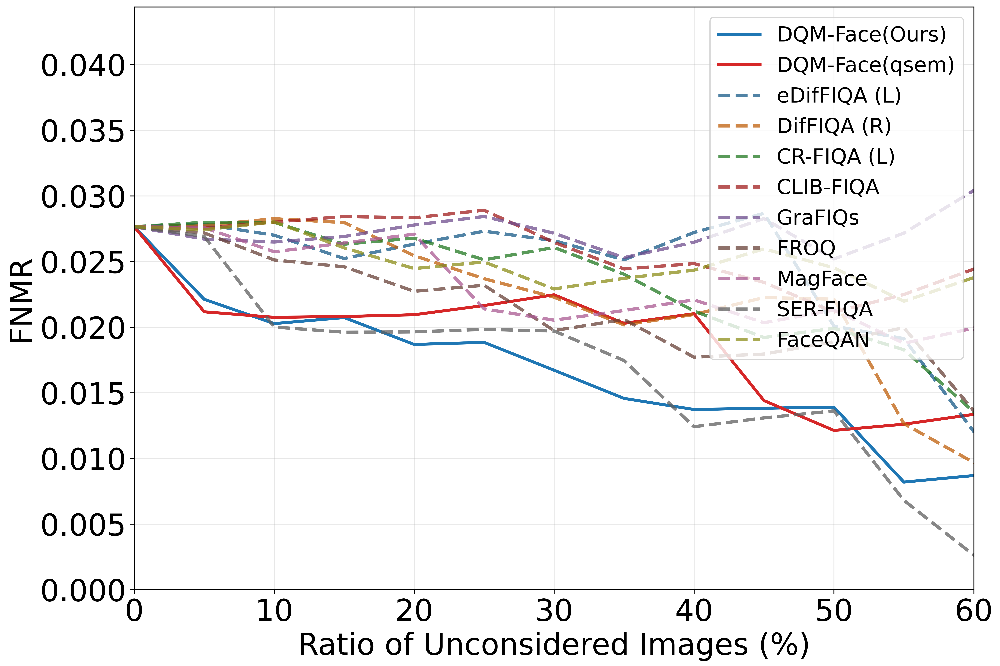
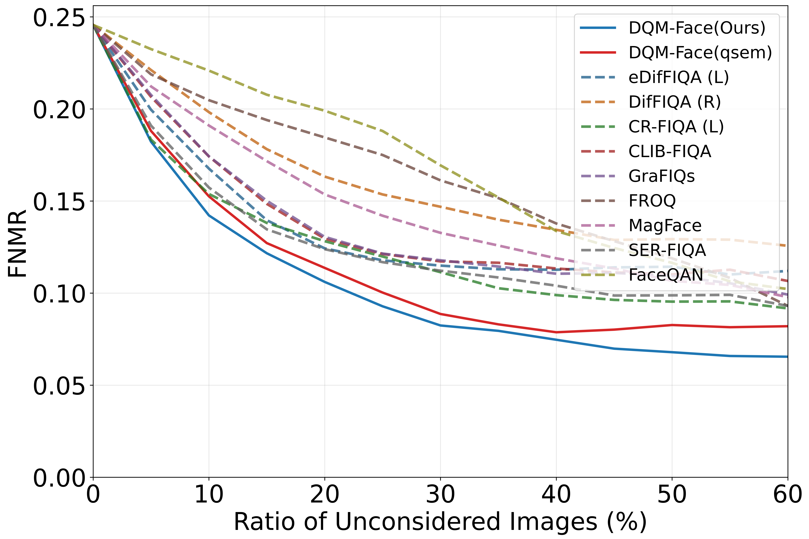
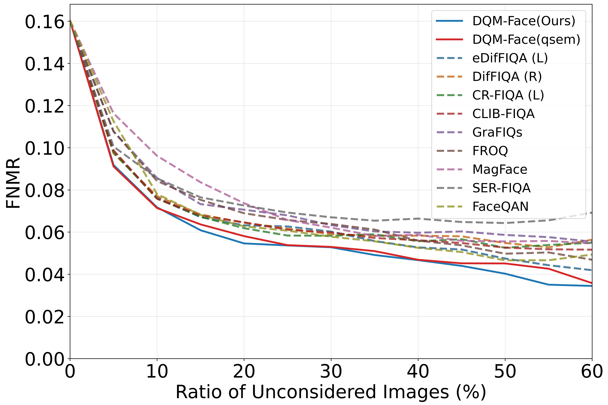
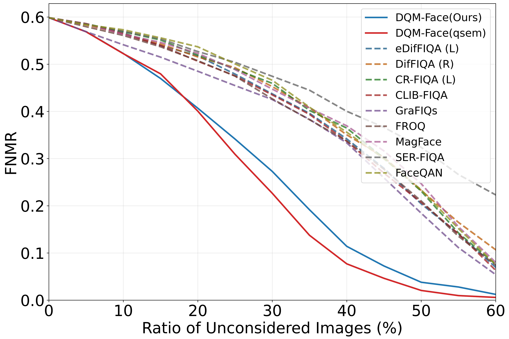

## Learning to Attract and Repel: Dual Quality Margin Learning for Face Recognition (DQM-Face)

_Accepted at the European Conference on Computer Vision (ECCV) 2026._

* [Research Paper](#) *(Link coming soon)*

## Table of Contents

- [Abstract](#abstract)
- [Results](#results)
- [Models](#models)
- [Getting Embeddings and Quality Estimates](#getting-embeddings-and-quality-estimates)
- [Training](#training)
- [Evaluation](#evaluation)
- [Citation](#citation)
- [Acknowledgement](#acknowledgement)
- [License](#license)

## Abstract

Face recognition systems in unconstrained environments have to deal with extreme variations (such as pose, illumination, and occlusion). To mitigate these effects, existing margin-based approaches model sample quality through feature magnitude. However, magnitude-based modeling alone is susceptible to identity-agnostic noise, which can degrade the reliability and discriminative power of learned representations. In this work, we propose **Dual Quality Margin Learning for Face Recognition (DQM-Face)**, a novel framework that enables refined attraction and repulsion dynamics during representation learning. Our approach unifies conventional magnitude-based quality estimation with a newly introduced semantic quality learning mechanism, realized via squeeze-and-excitation semantic attention. By jointly leveraging magnitude and semantic cues, we construct enhanced quality-aware margins that adaptively strengthen intra-class compactness through improved attraction during learning. To further enhance inter-class discrimination, we introduce a repulsion margin formulation that explicitly enlarges inter-class separation. The unified integration of semantic quality modeling with dual attraction–repulsion margin optimization results in a more structured and discriminative feature geometry. Extensive experiments demonstrate that DQM-Face consistently outperforms state-of-the-art face recognition methods on multiple challenging benchmarks.




Figure: Geometrical interpretation of feature space and decision boundaries for (a) Softmax baseline with inter-class overlap, (b) ArcFace with a fixed margin $m$, (c) our adaptive attraction margin $m_1$ calibrated by dual-quality fusion, (d) explicit inter-class repulsion $m_2$ pushing non-target features away, and (e) the resulting structured feature space characterized by maximized intra-class compactness and a wide Clearance Zone.

## Results


### Face Recognition Performance


To evaluate the proposed DQM-Face method, we compare its verification performance with state-of-the-art face recognition approaches on standard single-image benchmarks covering unconstrained (LFW), cross-pose (CFP-FP and CPLFW), and cross-age (AgeDB-30) face verification, as well as on the large-scale video-based IJB-B and IJB-C benchmarks. DQM-Face consistently achieves the best or second-best performance across all evaluated benchmarks. However, single-image benchmarks are relatively small in size, and the resulting performance differences are so minor that they cannot be considered statistically significant. Therefore, we additionally evaluate DQM-Face on the substantially larger IJB-B and IJB-C benchmarks, which provide stronger evidence of the proposed DQM-Face method.


<p align="center">
  
</p>


<p align="center">
  
</p>


<!-- ### Face recognition results

**Visual Attribution Analysis (Grad-CAM)** - To provide qualitative insight into the different quality branches, we employ Grad-CAM to visualize the spatial regions that contribute most to the recognition decision. The magnitude-only variant often exhibits attention dispersed toward non-discriminative regions (e.g., background textures) when affected by blur or occlusion. In contrast, our proposed DQM-Face (fused quality, $\alpha = 0.5$) combines the strengths of both quality cues, exhibiting well-localized and stable activation over the most informative facial regions while remaining robust to challenging imaging conditions.

<p align="center">
  
</p> -->

### Face Image Quality Assessment (FIQA) Performance

To measure the effectiveness of the proposed quality estimate utilized for margin learning, we evaluate FIQA performance using Error-vs-Discard Characteristics (EDC) and report the False Non-Match Rate (FNMR) at a fixed False Match Rate (FMR) of $10^{-3}$. The DQM-Face model demonstrates consistently strong performance, ranking among the top-performing methods across challenging datasets featuring age variations, pose variations, and unconstrained environments. This demonstrates that the learned quality signal is intrinsically aligned with the recognition objective, successfully learning identity-aware quality representations.


| LFW | Adience |
|:---:|:---:|
|  |  |
| *Unconstrained* | *Age variations* |

| CPLFW | XQLFW |
|:---:|:---:|
|  |  |
| *Pose variations* | *Image quality variations* |


## Models

We provide pre-trained models based on the iResNet-100 backbone trained on MS1MV2. These models are suitable for both recognition and quality estimation.

| Model | Pretrained model | Checkpoint | Description |
|:---|:---|:---|:---|
| **DQM-Face (α = 0.5)** | [Download](https://drive.google.com/file/d/1V1zmSWtPx7jKI4fQ-LzUPWTIrwjkPrik/view?usp=sharing) | [Download](https://drive.google.com/file/d/1g2XUd0_K6p_4gfgoXkqtt8cRhg9iLxcx/view?usp=sharing) | Best overall model with fused magnitude + semantic quality. |
| **DQM-Face (α = 0.4)** | [Download](https://drive.google.com/file/d/1kC_HitTbsHwlIcwfXZ0UAUO7ce3oun3P/view?usp=sharing) | [Download](https://drive.google.com/file/d/1cHOtunkSDd2fLhxEe5t6C1bnN4d0LlEr/view?usp=sharing) | Strong alternative weighting that works especially well on IJB-B and IJB-C. |
| **DQM-Face qsem (α = 1.0)** | [Download](https://drive.google.com/file/d/1aWGbFbMGMAlg9GUYHfOXQ4RvqzPi8HJp/view?usp=sharing) | [Download](https://drive.google.com/file/d/18GnDmG_6GNc0fFvJ_zLDNfZLqqgKy3gK/view?usp=sharing) | Semantic-quality-only variant for ablation studies. |


## Compute Embeddings

Run the following command to compute embeddings and quality scores for the example image:

```bash
cd inference && python get_emb.py
```

## Training

**Training Dataset:** In our paper, we employ the MS1MV2 dataset for training. This dataset can be downloaded from the InsightFace DataZoo (MS1M-ArcFace) via their [official datasets page](https://github.com/deepinsight/insightface/tree/master/recognition/_datasets_). Please ensure you strictly follow their license and distribution guidelines.

1. Download and unzip the dataset, then place it in your local `datasets/` folder.
2. Update the dataset path in `train.py` to point to this directory.
3. Run the training script using your preferred bash file (e.g., `bash scripts/run_train80G.sh`).

*Note: All code provided in this repository has been trained and tested using PyTorch 1.7.1.*

## Evaluation

**Evaluation on LFW, AgeDB-30, CPLFW, and CFP-FP:**

You can download the data from their official webpages.
*Alternative:* The evaluation datasets are already available in the training dataset package as `.bin` files.

1. Set `config.rec` to your dataset folder (e.g., `datasets/faces_emore`).
2. Set `config.val_targets` to the list of the evaluation datasets you wish to test.
3. Download the pre-trained model from the links provided in the Models section above.
4. Set `config.output` to the path of the downloaded pre-trained model weights.
5. Run the evaluation script:

```bash
python eval/validate.py
```

## Citation

If you use this code in your work, please cite the following paper:

```bibtex
@inproceedings{belabbaci2026dqmface,
    author    = {Belabbaci, El Ouanas and Wani, Bhavesh and Terh{"{o}}rst, Philipp},
    title     = {Learning to Attract and Repel: Dual Quality Margin Learning for Face Recognition (DQM-Face)},
    booktitle = {Proceedings of the European Conference on Computer Vision (ECCV)},
    year      = {2026}
}
```

## Acknowledgement

This work was funded by the Deutsche Forschungsgemeinschaft (DFG, German Research Foundation) under Grant 544631027.

## License

This project is licensed under the terms of the Attribution-NonCommercial 4.0 International (CC BY-NC 4.0) license. Copyright (c) 2026 Johannes Gutenberg University Mainz (JGU). You are free to use, modify, and redistribute this software for non-commercial research purposes, provided appropriate attribution is given. Commercial use requires prior permission from the copyright holder.
